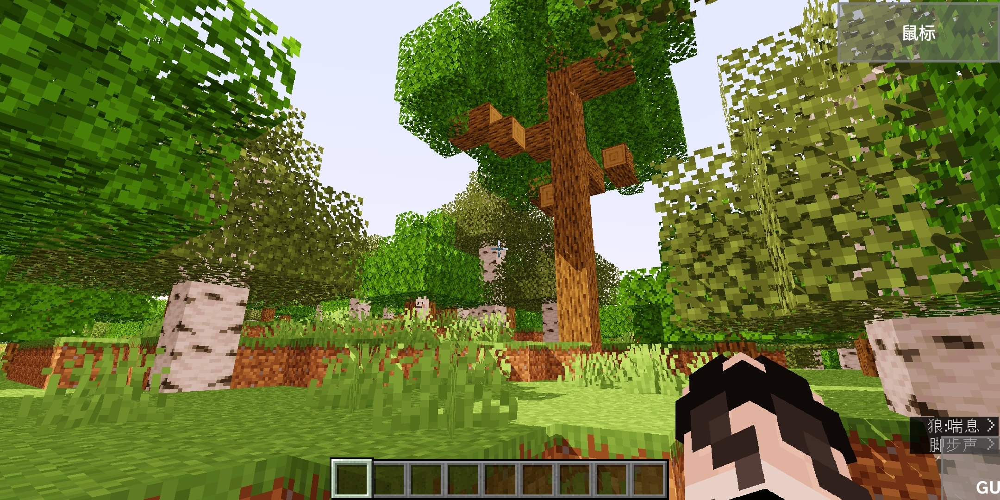
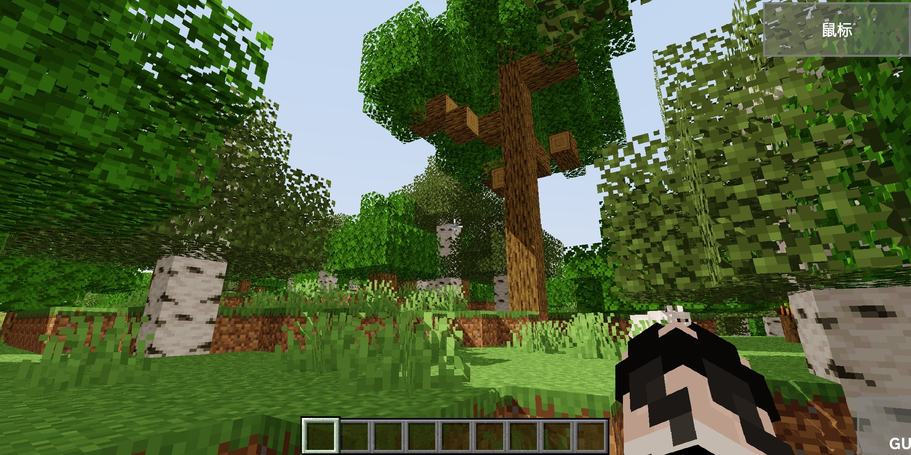
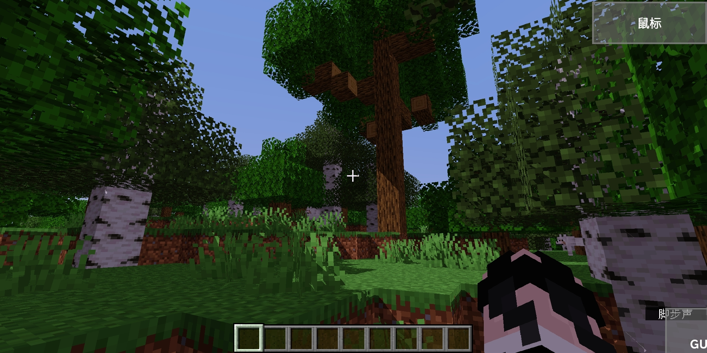

# Open4Es-Shader-Android
This shader can running on moblie device with GL4ES. Currently only Snapdragon devices are supported
## Open4Es-Chocapic:
  
## Open4Es-KUMA(KUDA/LUMA):
  
## Open4Es-SEUS:
  
### If you want to make video or share it to others,please use the GitHub Link and state the Author.
# Installation:

# Android:

# iOS:
According to Pojavlauncher developer khanhduytran0, this version also works on his iPhone

